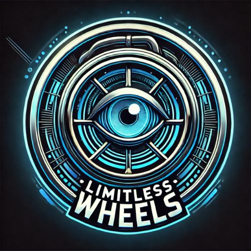
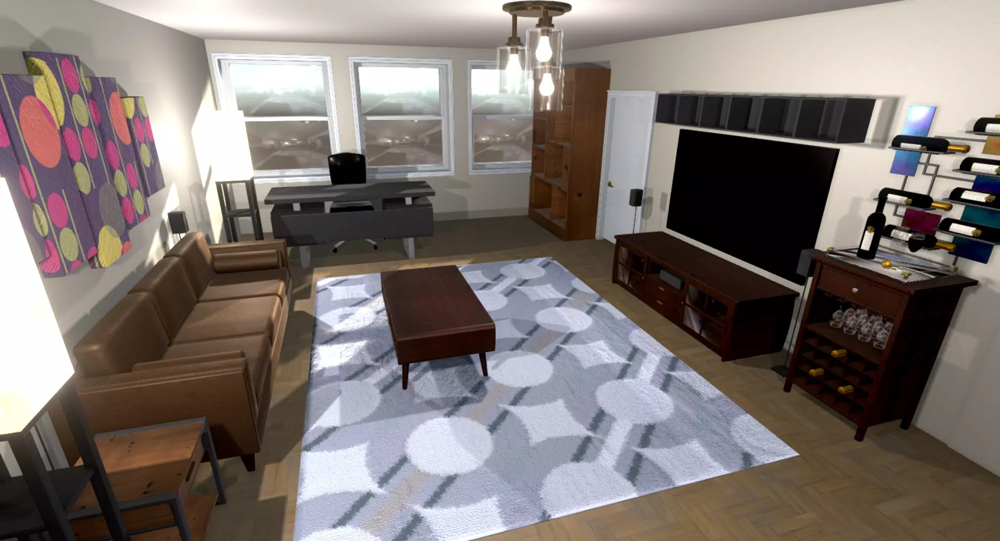
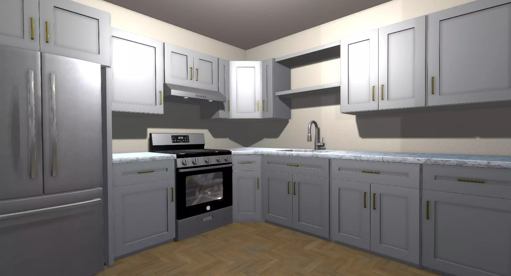

# Limitless Wheels

  

## Introduction
Limitless Wheels is an innovative XR experience designed for individuals in wheelchairs who can move their upper bodies. The goal of this experience is to provide a sense of freedom and rehabilitation by allowing users to practice daily tasks in a safe and controlled environment. Many individuals in wheelchairs need to relearn independent living, and Limitless Wheels offers a way to engage in these activities in an immersive virtual space.

## Design Process

Many wheelchair users face challenges when adapting to everyday life. They need to practice mobility and interaction within their living spaces while maintaining independence. The lack of engaging, hands-free virtual rehabilitation tools motivated the development of this experience.

### Brainstorming

The initial idea was to create a virtual reality experience specifically designed for wheelchair users. At first, I considered managing movement through a controller. However, this approach had significant limitations: it required the user to dedicate one hand solely to navigation, which not only restricted their interaction with the virtual environment but also undermined the immersive nature of the experience.

After reflecting on this challenge, I realized that allowing users to have both hands free would greatly enhance the experience. This led me to explore eye-tracking technology as a potential solution for movement control. By leveraging eye-tracking, users could navigate the virtual environment seamlessly without physical constraints, making the experience more intuitive and immersive.

The rehabilitation tasks included in this experience were deliberately designed to be simple and intuitive. The primary goal is not to challenge users with complex interactions but rather to encourage them to explore the surrounding space using eye-tracking technology. This approach allows them to experience movement freely, without the usual impediments and limitations of being in a wheelchair, fostering a greater sense of independence and immersion.

### Target Users
This project is designed for wheelchair users with upper-body mobility and those in rehabilitation looking to regain independence. It offers a safe and controlled virtual space where users can practice movement and daily tasks without physical risks.

Traditional rehabilitation exercises can feel repetitive and uninspiring, making it hard to stay motivated. Many VR applications require hand controllers, which can be limiting and reduce accessibility. To overcome this, eye-tracking technology is used for movement control, allowing users to navigate naturally while keeping their hands free.

By removing these barriers, this experience makes rehabilitation more engaging, intuitive, and effective. It encourages users to develop confidence, independence, and better mobility in a way that feels both practical and immersive.

## System description

### Features

- Virtual Apartment: A realistic, interactive space where users perform everyday tasks.
  

  
  

- Eye-Tracking Navigation: Users move by looking at directional arrows, freeing their hands for interactions.
- Hands-Free Object Interaction: A touch and grabbable system in Unity allows natural object manipulation.
- Task Completion System: Tasks like setting the table and organizing objects reinforce rehabilitation and independence.
- End-of-Experience Event: A rewarding conclusion signaled by a doorbell, reinforcing accomplishment. Additionally, background music is played throughout the experience to make it more enjoyable and inclusive.

#### Navigation System

The movement system is designed to be completely hands-free, using an eye-tracking interface for navigation. Users can move along the horizontal axis by looking at directional arrows displayed in front of the camera. These arrows adjust dynamically, following the rotation of the user’s head, allowing for a natural and intuitive way to control movement.

To ensure a seamless and non-intrusive experience, the arrows are colored in a semi-transparent white, preventing any obstruction of vision or discomfort for the user. When a user focuses on a specific arrow, its transparency level slightly changes, providing subtle visual feedback.

The eye-tracking beam, which extends from the user's eyes, has been deliberately made invisible to avoid distractions and to keep the experience as immersive and realistic as possible. However, when the user looks at one of the arrows, the previously invisible beam turns red, and the arrow’s transparency adjusts accordingly to indicate activation of the movement. This design choice ensures that navigation remains intuitive while maintaining a clean and unobtrusive visual interface.

Additionally, the arrows have been designed to remain visible and accessible to the user's eye-tracking beam even through walls and objects, ensuring that movement is always possible regardless of the user's position in the environment. Furthermore, the arrows do not collide with objects, allowing for smooth and uninterrupted navigation.

This system offers several key benefits:
- Intuitive Movement – No need for controllers, making navigation seamless.
- Focus on Tasks – Users can concentrate on interactions rather than on movement mechanics.
- Increased Accessibility – Ideal for individuals with limited hand function, ensuring a more inclusive experience.

#### Object Interaction System

Using a Touch & Grabbable System in Unity, users can:
- Pick up and move objects naturally.
- Interact with items in a realistic manner.
- Precisely place objects where needed.
- If an object accidentally falls to the floor, it is automatically repositioned to its initial location, ensuring a smooth and frustration-free interaction.

Watch the demo video or try the live version.

Link: <https://extralitylab.dsv.su.se/>

## Installation

This section outlines the steps to set up your environment for developing Android VR applications using Unity 2022.3 or higher:

### Installing Meta Software

1. [Create Meta account](https://developers.meta.com/horizon/)
2. [Download and install Meta Quest Developer Hub](https://developers.meta.com/horizon/documentation/unity/ts-odh/)
3. [Download and install Meta Quest Link](https://www.meta.com/engb/help/quest/1517439565442928/) (only useful if you use Windows and you have a laptop with dedicated graphics card compatible with VR)

   
### Installing Unity Editor and Configuring XR Packages

1. [Create a Unity ID](https://unity.com/)
2. [Download and install Unity Hub from Link](https://unity.com/download)
3. [Download and install Unity Editor LTS](https://unity.com/releases/editor/archive) (Recommended version: v2022.3.XX (any minor version))
4. Follow the instructions to complete the Unity Editor installation.
5. You need to manage your license: choose a free personal license

### Configuring a Unity Project for Meta Quest Development

1. Create empty project: Choose the template 3D (URP)
2. Switch build platform: Choose the platform Android
3. Import Meta XR SDKs (com.meta.xr.sdk.all)

### Configure XR in Project Settings

1. In Project Settings, in the section XR Plugin Management, install the plugin.
2. In the section XR Plugin Management: choose the tab with the Android icon, and tick the Oculus Plug-in provider. Then, also choose the tab with the Desktop icon, and tick Oculus
3. Click on the Meta XR option on the left menu Click on Fix All

### Add an XR Camera

1. Remove the Main Camera.
2. Add a Camera Rig object to the scene.

### Build your XR App

1. File > Build Settings
2. You should see the Android version
3. Press Build and select a name for the requested .apk file

## Usage

To use Limitless Wheels and interact with its features, follow the guidelines below:

- To move around, the user looks at one of the four arrows displayed in front of the camera, and movement occurs in the direction of the selected arrow. To rotate, the user must physically turn their body.
- To grab and move objects, the user interacts with them virtually, simulating a natural grasping motion within the virtual environment. However, the user can only grab and move objects that are colored gold, making it clear which items are interactive.
- If an object that has been grabbed accidentally falls, it will automatically return to its initial position. This prevents frustration and ensures that the user, who may have difficulty picking it up manually, can continue interacting with the virtual environment without interruptions.
- The user must collect all the gold-colored objects placed on the gold-colored table in the room. This ensures a clear visual distinction of interactive elements, guiding the user through the task.

Some tips, tricks, and best practices for using Limitless Wheels effectively:
The arrows that determine the movement direction have been positioned strategically to minimize interference with task execution. This ensures that users can navigate smoothly without distractions while focusing on their interactions within the virtual environment. However, users must be careful not to look at the arrows unintentionally when they do not intend to move. This helps prevent accidental movements and ensures a smoother experience.

## References
### Unity Assets
- [Apartment Kit](https://assetstore.unity.com/packages/3d/environments/apartment-kit-124055)
- [WhellChair](https://assetstore.unity.com/packages/3d/props/whellchair-260547)
- [Dining Set](https://assetstore.unity.com/packages/3d/props/interior/dining-set-37029)
- [FREE Ultimate Procedural Primitives](https://assetstore.unity.com/packages/tools/level-design/free-ultimate-procedural-primitives-227955)

## Contributors
[Jacopo Levati](https://www.linkedin.com/in/jacopo-levati-335a1224b?lipi=urn%3Ali%3Apage%3Ad_flagship3_profile_view_base_contact_details%3B8%2BRihYZHQqGImBcDq6%2FxRQ%3D%3D)

